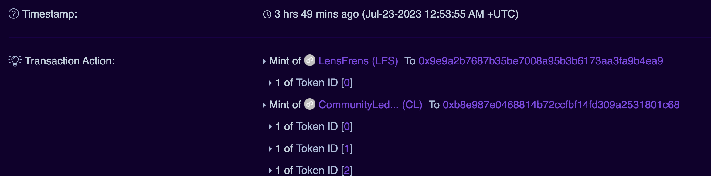
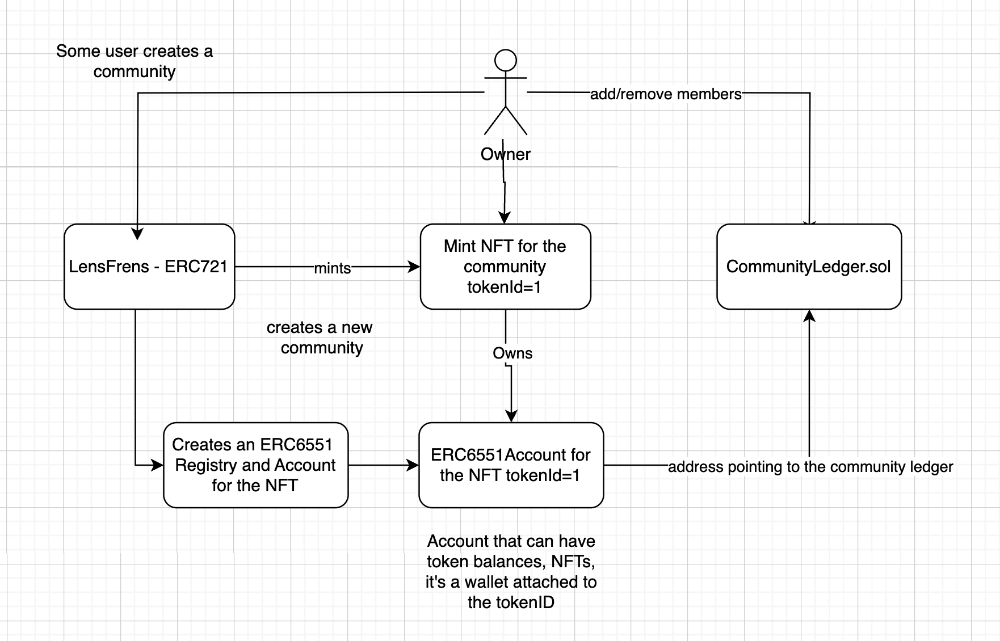

### About 

OnlyFrens 

ERC-6551 Standard to create communities that holds nfts of members, so every platform you go you can bring your communities with you.

### ERC 6551


<br/>


### Contracts

LensFrens ERC-6551 implemented: https://polygonscan.com/address/0x91de78d33aac5948654ffea3d2b35625c45d4bb5#code

CommunityLedger: https://polygonscan.com/address/0x32bf852c06b424a907875cd03d68b827e30f3099#readContract

The test script related to that contract:
https://github.com/BrunoEleodoro/onlyfrens/blob/main/contracts/test/examples/simple/LensFrensTest.sol#L49-L113

The contract itself implementing ERC 6551
https://github.com/BrunoEleodoro/onlyfrens/blob/main/contracts/src/production/LensFrens.sol

```
cd contracts
forge test -vv
```

### Transaction example
https://polygonscan.com/tx/0x9cc69d6d8974173cd72219ca1c597a776e583fe1f19bcaaf681c233a0ae99b05

### Frontend

Create community transaction using wagmi:
https://github.com/BrunoEleodoro/onlyfrens/blob/main/frontend/src/pages/Create/Create.tsx#L23-L49

View my communities: https://github.com/BrunoEleodoro/onlyfrens/blob/main/frontend/src/pages/ViewMyGroups/ViewMyGroups.tsx#L10-L18

```
cd frontend
yarn
yarn dev
```